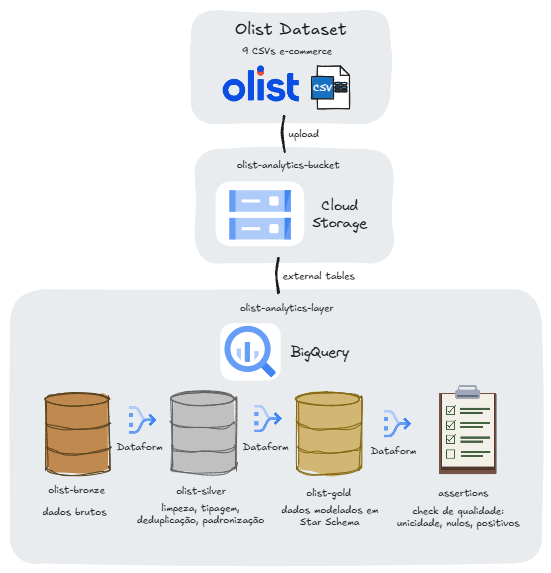

# olist-analytics-layer

Camada analítica construída sobre o [Brazilian E-Commerce Dataset (Olist)](https://www.kaggle.com/datasets/olistbr/brazilian-ecommerce), utilizando **Google Cloud Platform**, **BigQuery** e **Dataform**.

O projeto estrutura os dados de larga escala, com pipeline completo desde a ingestão de dados brutos até marts dimensionais prontos para consumo, aplicando boas práticas de Analytics Engineering: modelagem em camadas, testes de qualidade, documentação e versionamento.

---

## Stack

| Camada | Tecnologia |
|---|---|
| Armazenamento raw | Google Cloud Storage |
| Data Warehouse | BigQuery |
| Transformação | Dataform (SQL) |
| Qualidade | Dataform Assertions |
| Versionamento | Git + GitHub |

---

## Arquitetura

O pipeline é organizado em três camadas dentro do BigQuery, seguindo a abordagem medallion:



### Bronze · `olist_bronze`
Dados brutos ingeridos via **external tables** apontando diretamente para os arquivos CSV no Cloud Storage. Nenhuma transformação é aplicada, todas as colunas são mantidas como `STRING` para preservar rastreabilidade e evitar falhas de parsing na ingestão.

### Silver · `olist_silver`
Modelos Dataform responsáveis por limpeza, tipagem e padronização dos dados. Cada tabela bronze origina uma tabela silver correspondente (relação 1:1). Nenhuma regra de negócio é aplicada aqui.

Transformações aplicadas:
- Conversão de datas: `PARSE_TIMESTAMP` para campos temporais
- Tipagem: `CAST` para campos numéricos
- Padronização de texto: `LOWER` + `TRIM` em cidades e categorias
- Deduplicação: `ROW_NUMBER()` com `PARTITION BY` para remover registros duplicados (ex: múltiplas avaliações por pedido)

### Gold · `olist_gold`
Modelagem dimensional em **Star Schema** com marts prontos para consumo. Utiliza `${ref()}` do Dataform para resolução automática de dependências entre camadas.

| Tabela | Tipo | Descrição |
|---|---|---|
| `fato_pedidos` | Fato | Métricas de pedidos: valor, frete, prazo, review score, entrega no prazo |
| `dim_cliente` | Dimensão | Clientes únicos com cidade, estado e região do Brasil |
| `dim_produto` | Dimensão | Produtos com categoria traduzida e seller associado |
| `dim_data` | Dimensão | Datas geradas a partir dos pedidos com granularidade dia/mês/trimestre/ano |

---

## Qualidade de Dados

Testes implementados via **Dataform Assertions**: cada assertion deve retornar zero linhas para o pipeline ser considerado válido.

| Assertion | O que valida |
|---|---|
| `assert_dim_cliente_unique` | `customer_id` único na `dim_cliente` |
| `assert_dim_produto_unique` | `product_id` único na `dim_produto` |
| `assert_fato_nulos` | Campos essenciais da fato não podem ser nulos |
| `assert_fato_valores_positivos` | `valor_produtos` e `valor_frete` sempre positivos |

**Resultado:** ✅ 0 falhas em todas as assertions

---

## Estrutura do Repositório

```
olist-analytics-layer/
│
├── arquitetura/
│   └── diagram.png
│
├── sql/
│   └── bronze/
│       └── external_tables.sql
│
├── dataform/
│   └── definitions/
│       ├── silver/
│       │   ├── silver_orders.sqlx
│       │   ├── silver_customers.sqlx
│       │   ├── silver_order_items.sqlx
│       │   ├── silver_payments.sqlx
│       │   ├── silver_reviews.sqlx
│       │   ├── silver_products.sqlx
│       │   ├── silver_sellers.sqlx
│       │   └── silver_category_translation.sqlx
│       ├── gold/
│       │   ├── fato_pedidos.sqlx
│       │   ├── dim_cliente.sqlx
│       │   ├── dim_produto.sqlx
│       │   └── dim_data.sqlx
│       └── assertions/
│           ├── assert_dim_cliente_unique.sqlx
│           ├── assert_dim_produto_unique.sqlx
│           ├── assert_fato_nulos.sqlx
│           └── assert_fato_valores_positivos.sqlx
│
└── README.md
```

---

## Decisões Técnicas

**Por que external tables na bronze?**
External tables permitem consultar os dados diretamente no Cloud Storage sem duplicar o armazenamento no BigQuery. O custo de storage é menor e qualquer atualização nos arquivos de origem é refletida automaticamente, sem necessidade de reprocessamento.

**Por que tipagem STRING na bronze?**
A camada bronze é fiel à fonte. Converter tipos nessa camada introduz risco de falha silenciosa, um valor inesperado num campo numérico quebraria a ingestão. A tipagem é responsabilidade da silver.

**Por que Star Schema na gold?**
Star Schema é otimizado para leitura analítica. A separação entre fato e dimensão também torna o modelo mais fácil de entender por analistas não técnicos.

**Por que Dataform e não SQL puro?**
Dataform traz práticas de engenharia de software para transformações SQL: versionamento, dependências automáticas via `${ref()}`, testes declarativos e documentação. É conceitualmente equivalente ao dbt, com a vantagem de ser nativo no GCP (sem infraestrutura adicional).

---

## Como Reproduzir

**Pré-requisitos**
- Conta GCP com projeto criado
- BigQuery habilitado
- Cloud Storage bucket criado
- Dataform habilitado no BigQuery Console

**1. Ingestão**
Faça o download do dataset no [Kaggle](https://www.kaggle.com/datasets/olistbr/brazilian-ecommerce) e faça upload dos CSVs para o bucket GCS.

**2. Bronze**
Execute o script `sql/bronze/external_tables.sql` no BigQuery Console para criar as external tables.

**3. Silver e Gold**
No Dataform, execute todos os modelos em `definitions/silver/` e `definitions/gold/`. O Dataform resolve as dependências automaticamente na ordem correta.

**4. Assertions**
Execute os arquivos em `definitions/assertions/`. Todos devem retornar zero linhas.

---

## Sobre o Projeto

Este projeto foi construído como exercício prático de Analytics Engineering, aplicando conceitos de:
- Arquitetura de dados em camadas (medallion architecture)
- Modelagem dimensional (Star Schema)
- Qualidade e governança de dados
- Boas práticas de engenharia analítica com Dataform

## Desenvolvido por

- **Nome:** Isadora Torqueti
- **GitHub:** https://github.com/isatorqueti
- **Linkedin:** https://www.linkedin.com/in/isadoratorqueti/